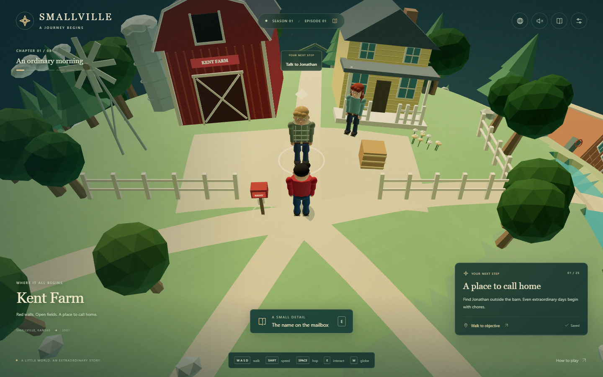

# Smallville Journey

A playable, original low-poly fan adaptation of the **Smallville pilot**, set on a miniature spherical world. English interface and dialogue, keyboard/mouse and touch controls, local saves, and a complete 26-objective story across eight chapters.



[View the mobile preview](docs/preview-mobile.png).

[Strength encounter](docs/preview-power.png) · [Strength encounter on mobile](docs/preview-power-mobile.png)

[The investigation board](docs/preview-investigation.png) · [Investigation on mobile](docs/preview-investigation-mobile.png)

## Run locally

Requires Node.js 22.12+ (verified with Node 22.16) and a browser with WebGL 2 and graphics acceleration.

```sh
npm install
npm run dev
```

Open **http://127.0.0.1:5187**. In Windows PowerShell, use `npm.cmd` instead of `npm` if the script execution policy blocks `npm.ps1`. Browser tests start their own temporary server on port 5188, keeping the game preview separate from other projects.

```sh
npm run build          # TypeScript checks and production build in dist/
npm run preview        # Preview the production build locally
npm test               # Story, save, spherical movement, and real-world routing tests
npm run test:e2e       # Chromium desktop + emulated Android browser journeys
```

If Playwright does not already have a Chromium browser installed, run `npx playwright install chromium` once. No browser extensions, accounts, API keys, or network-loaded game assets are required.

## Play

Jeremy's truck confrontation uses a first-person view and a 3.5-second reaction window: press E or tap **Stop the truck**. A missed response offers a retry without losing progress.

Choose **Begin your journey**, watch or skip the opening, and find Jonathan outside the barn. The gold marker identifies the next story interaction. Walking to a place does not complete a quest: use its gold prompt to talk, inspect, or help. Four major strength/rescue encounters require you to hold E, Space, or the touch button, then release inside the gold control window. Complete each step and choose **Finish the move**. A mistimed release lets you retry without losing story progress. Conversations can include optional questions; choose **Continue the story** to finish them.

At the Wall of Weird, read three evidence cards and connect what happened to Jeremy. Wrong answers provide a hint rather than completing the objective. Small floating page markers identify six optional observations: examine them with E or their prompt, then revisit collected moments under **The story** in the journal. They save independently of the main quest.

| Action | Computer | Touch |
| --- | --- | --- |
| Walk | WASD / arrow keys | Left joystick |
| Super speed | Hold Shift while moving | Hold SPEED while moving |
| Jump | Space | Jump button |
| Interact | E | Gold action button |
| Camera orbit | Drag | Drag |
| Zoom | Scroll | Pinch |
| Globe / follow | M or globe button | Globe button |
| Journal | J or book button | Book button |
| Auto-walk | Click ground / Walk to objective / journal place | Tap ground / Walk to objective / journal place |
| Cancel route | Escape or manual movement | Cancel route or joystick |

Stay away from green meteor stones to recover Clark's strength. The river is swimmable; the bridge deck is walkable. Metropolis is visible but stays closed until a future episode. The school race can be retried without losing earlier progress. Settings include sound, reduced motion, and graphics quality.

The intended first-play duration is **10–15 minutes**, depending on reading, optional conversations, and exploration. This is a design target, not a timed usability result. Automated tests advance dialogue immediately and finish sooner.

## The first episode

The pilot covers the meteor-shower opening, the Kent family, the missed bus and school day, Lana's necklace, Lex's rescue, the spacecraft, the cemetery and mansion conversations, the Wall of Weird, Riley Field, Jeremy's confrontation, and the barn ending. All dialogue is newly written for this compressed game adaptation. Some activities and presentation are simplified for play.

The world and character models are generated in Three.js. Gameplay sound effects and ambience are synthesized with Web Audio. The opening screen and prologue use the supplied piano MP3 in `public/audio/opening-piano.mp3`; choose **Play opening music** to enable it. The shared sound control mutes it, and it stops when gameplay begins. The file streams on demand rather than blocking initial loading. The project does not embed episode footage, cast recordings, or a television soundtrack. The underlying Little Planet code is not a dependency.

## Saves and replay

Progress is stored under `smallville-journey-save-v1` in this browser's local storage. A save records the next objective, a safe checkpoint, discoveries, and completion status. Mid-conversation reloads restart that conversation. Mid-action reloads restart the action. Carrying Lex, restraint, story props, and actor placements are reconstructed from the completed objective prefix.

Settings are stored separately under `smallville-settings-v1`. A corrupt or incompatible save returns to a fresh title screen with an explanation; it is not overwritten until the player starts. Storage failures show a persistent warning while allowing the game to continue in memory. Clearing browser data removes saves. Restarting requires an explicit in-game confirmation.

Browser storage belongs to the exact site address, including its port. The dedicated preview now runs on 5187; a save made on an older preview address is still associated with that older address, rather than automatically transferred between ports.

## Structure

- `src/content/`: episode definitions, dialogue, locations, and character names.
- `src/core/`: story/save state, episode world-state resolution, fixed-step movement, spherical navigation, input, camera, and synthesized audio.
- `src/world/`: original geometry factories, character rigs, static batching, instanced vegetation, and story-dependent visuals.
- `src/main.ts`: game lifecycle and the connection between input, story, world, and UI.
- `src/ui.ts` and `src/style.css`: accessible HTML controls, conversations, journal, settings, and responsive layout.
- `e2e/`: real browser journey tests. Failure artifacts and review screenshots are written under `test-results/`.

See [Adding an episode](docs/ADDING_EPISODES.md) for the content workflow and boundaries between data and new mechanics.

See [Development status](docs/DEVELOPMENT_STATUS.md) for the implemented scope, latest changes, and future campaign work.

See [Art direction and pilot references](docs/ART_DIRECTION.md) for the visual research and the interactive changes.

The pilot's actor placements, props, darkness, kryptonite, carrying, and restraint are defined in `src/content/pilot-world.ts` using stable objective IDs. The renderer reconstructs those rules on every checkpoint. Introductions, transitions, powers, journal labels, and ending text also come from the episode definition. Existing pilot saves retain their original key and format; additional episode definitions have separate save keys.

## Rendering and diagnostics

Graphics quality automatically reduces shadows and pixel density for touch devices. Desktop quality can also adapt when frames remain slow. **Battery saver** forces the simpler renderer. `?quality=low` is a shareable quality override used by browser tests. `?no-webgl=1` exercises the unsupported-browser view.

The 3D scene pauses behind conversations and open menus, and when the window loses focus. Power encounters keep the scene visible and animate the object under strain beside a compact control panel. Leaving an encounter restores the prop, and losing focus releases held input. HTML controls continue updating while the scene is paused.

The hidden `#telemetry` output contains non-sensitive local runtime state for automated testing. Development builds also expose a small `window.__smallville` interface for reading a snapshot or requesting normal navigation; production builds omit it. There is no analytics service.

Browser tests emulate a phone's viewport and touch input; they are not measurements on a physical phone. Manual checks on intended hardware are still needed before committing to a device-specific frame-rate target.

The test suite covers all 25 objectives, a reload during Lex's rescue, the saved ending, optional dialogue, mobile viewport bounds, simultaneous joystick/speed/jump input, keyboard movement, input cancellation, held-input strength encounters, incorrect deductions, field-note persistence, race timeout/retry, and storage/WebGL failures. Timing-sensitive movement, cancellation, and timeout checks use Playwright's browser clock. Complete story journeys navigate and converse in normal browser time, briefly controlling the clock inside power encounters to make held input reproducible on busy machines. All encounters are completed through their real keyboard/touch controls.

Browser tests use the system graphics backend by default. For a headless environment without usable graphics acceleration, set `SMALLVILLE_SOFTWARE_WEBGL=1` to opt into Chromium's software renderer. The race timer counts active play time independently of frame rate and pauses when the game loses focus, is hidden, or has a menu/dialogue open.

## Story references

- [Pilot overview](https://en.wikipedia.org/wiki/Pilot_(Smallville))
- [Pilot episode guide](https://smallville.fandom.com/wiki/Pilot)
- [Official episode description on Apple TV](https://tv.apple.com/us/episode/pilot/umc.cmc.6yxic14m7zagiuckpnqelaff1?showId=umc.cmc.3oxo773g0bf8tylw00pccrhqs)

The prototype is an unofficial fan project. Smallville and its characters belong to their respective owners.

## Deploy to Netlify

Import this GitHub repository in Netlify and select the `main` branch. The checked-in `netlify.toml` sets Node 22, the build command `npm run build`, and the publish directory `dist`. No environment secrets or backend service are needed. Netlify must have access to the repository if it is private.

Runtime character models and the comparison model are included in `public/`. Large raw OBJ source imports under `docs/*-review/source/` and local conversion intermediates are intentionally excluded from Git. They are only required when rebuilding imported models, not to build or play the game.

Saves belong to the browser and site address. Localhost progress is not automatically transferred to the deployed site.
